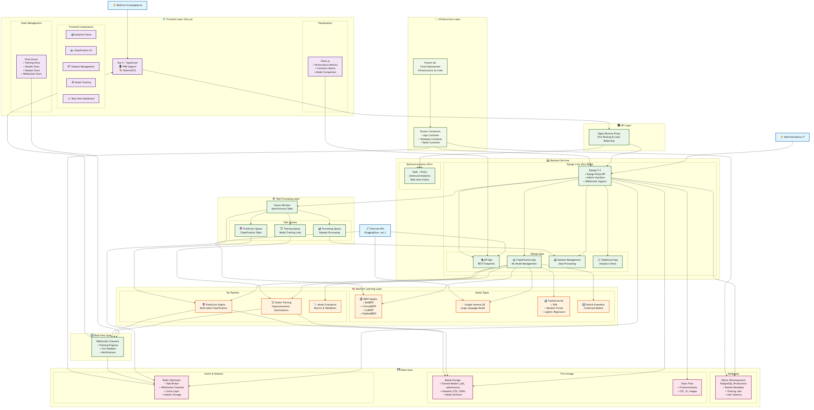
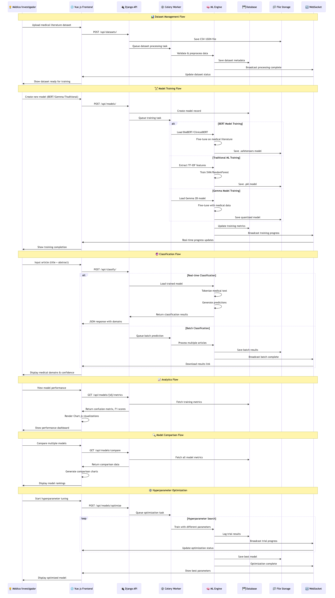
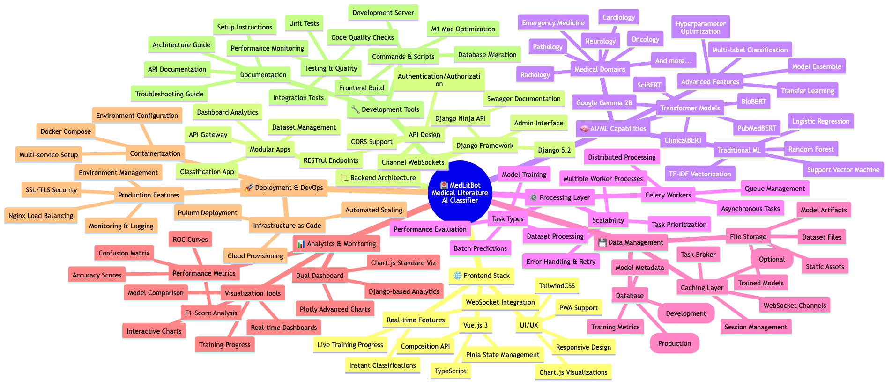

# 🤖 MedLitBot - Medical Literature AI Classifier

> **Ready-to-use AI system for classifying medical literature** with pretrained models included!

A powerful Django + Vue.js AI system that classifies medical articles into specialized domains using only the title and abstract. **No training required** - comes with working pretrained models for immediate testing.

## ⚡ Quick Start Demo

Get MedLitBot running in under 5 minutes:

### 1️⃣ Clone & Setup
```bash
git clone https://github.com/DiegoBerSource/medlitbot.git
cd medlitbot
pip install -r requirements.txt
```

### 2️⃣ Start the Backend System
```bash
# For M1/M2 Macs (Apple Silicon optimized)
./commands/start_m1.sh

# For Intel/AMD systems and Linux
./commands/start.sh
```

### 3️⃣ Start the Frontend (in a new terminal)
```bash
./commands/dev-server.sh
```

### 4️⃣ Open & Explore
- **Frontend**: http://localhost:3000 (Modern Vue.js interface)
- **API Docs**: http://127.0.0.1:8000/api/docs (Interactive Swagger UI)  
- **Admin**: http://127.0.0.1:8000/admin/ (Django admin interface)

### 🔑 Demo Admin Access
```
Username: demo
Password: demo123
```

## 🎯 What's Included - Ready to Use!

### 🤖 **Pretrained Models**
- **Dr Clasifier BERT**: Transformer model (82.6% accuracy, 92.7% F1)
- **Dr Clasifier ML**: Traditional ML model (73.6% accuracy, 84.8% F1)

### 📊 **Features You Can Try Immediately**
- ✅ **Classify Medical Articles**: Input title + abstract, get medical domains
- ✅ **Performance Analytics**: View confusion matrices and model comparison
- ✅ **Batch Classification**: Process multiple articles at once
- ✅ **Real-time Results**: WebSocket-powered live updates
- ✅ **Interactive Charts**: Beautiful visualizations with Chart.js

### 📁 **Demo Data Included**
- Sample medical literature datasets
- Pretrained model files (traditional + BERT transformer)
- Performance metrics and confusion matrices
- Realistic demo database

## 🖥️ System Requirements

### **M1/M2 Mac Users** (Apple Silicon)
Use `./commands/start_m1.sh` for optimal backend performance:
- Optimized for M1/M2 processors with MPS acceleration
- Memory-efficient settings for MacBook development
- Single-threaded Celery configuration for stability
- Uses SQLite for simplified development

### **Intel/AMD Systems & Linux**
Use `./commands/start.sh` for standard backend setup:
- Works on Linux, Windows, Intel Macs
- Multi-threaded processing for better performance
- Standard CPU-based training and inference
- Automatic dependency detection

### **Frontend Development**
Both system types use `./commands/dev-server.sh` for Vue.js frontend:
- Modern Vue 3 + TypeScript development server
- Hot module replacement for fast development
- Automatic browser refresh on changes

## 🚀 Usage Examples

### Classify a Medical Article
```python
# Via Python API
from classification.ml_models import get_trained_model
model = get_trained_model('Dr Clasifier BERT')
result = model.predict(
    title="COVID-19 cardiac complications",
    abstract="Study of cardiac effects in COVID patients..."
)
```

### Via REST API
```bash
curl -X POST http://localhost:8000/api/classify/ \
  -H "Content-Type: application/json" \
  -d '{
    "model_id": 24,
    "title": "COVID-19 cardiac complications",
    "abstract": "Study of cardiac effects..."
  }'
```

## 🎨 Modern Frontend Features

- **Vue 3 + TypeScript** with improved type safety
- **TailwindCSS** responsive design
- **Chart.js** analytics and confusion matrix visualization
- **PWA Support** - works offline
- **Real-time Updates** via WebSockets
- **Mobile Responsive** design

## 📚 Available Commands

All scripts are organized in the `commands/` folder:

### **Backend System Startup**
- **`start_m1.sh`** - Complete system for M1/M2 Macs (Django + Celery, Apple Silicon optimized)
- **`start.sh`** - Complete system for Intel/AMD/Linux (Django + Celery, standard config)

### **Frontend Development**  
- **`dev-server.sh`** - Vue.js development server with hot reload

### **Build & Setup**
- **`build-frontend.sh`** - Build Vue.js frontend for production
- **`frontend_setup.sh`** - Set up and build frontend dependencies

### **Typical Workflow**
```bash
# Terminal 1: Start backend
./commands/start_m1.sh        # OR ./commands/start.sh

# Terminal 2: Start frontend  
./commands/dev-server.sh

# Visit http://localhost:3000 for full system
```

## 🔧 Troubleshooting

### Can't Access Admin or API Docs?

**1. Make sure the backend is running:**
```bash
# Check if Django server is running on port 8000
curl http://127.0.0.1:8000/api/docs
```

**2. Use the correct URLs:**
- ❌ Wrong: `http://localhost:8000/admin`
- ✅ Correct: `http://127.0.0.1:8000/admin/` (note the trailing slash)

**3. Admin login credentials:**
```
Username: demo
Password: demo123
```

**4. If admin still doesn't work:**
```bash
# Create a new superuser
python manage.py createsuperuser
```

### Port Already in Use?
```bash
# Kill any existing Django processes
pkill -f "python manage.py runserver"
# Then restart with your preferred command
```

## 🔧 Advanced Setup

### Custom Configuration
Create a `.env` file with your settings:
```bash
cp env.example .env
# Edit .env with your Hugging Face token and database settings
```

### Train Your Own Models
1. Upload your dataset via the web interface
2. Go to Models → Create New Model
3. Choose BERT, Traditional ML, or Gemma model types
4. Configure hyperparameters and start training
5. Monitor progress in real-time

## 🎓 What You'll Learn

This system demonstrates:
- **Modern ML Architecture**: Django + Celery + Redis + PyTorch
- **Transformer Models**: BERT for medical text classification
- **Traditional ML**: SVM, Random Forest comparison
- **Full-Stack AI**: Backend ML with modern frontend
- **Production Deployment**: Docker, infrastructure as code
- **Real-time AI**: WebSocket integration for live updates

## 🏗️ System Architecture

### 📊 Complete Architecture Overview



**[🔍 View Interactive Diagrams](diagrams/view-diagrams.html)** | **[📁 All Diagram Files](diagrams/)**

### 🎯 Key Architecture Components

#### **🌐 Frontend Layer (Vue.js)**
- Vue 3 + TypeScript with PWA support
- Real-time WebSocket integration
- Chart.js visualizations for analytics
- Responsive design with TailwindCSS

#### **🏭 Backend Services**
- **Django Core (Port 8000)**: REST API, Admin, WebSocket support
- **Optional Analytics (Port 8050)**: Advanced Plotly dashboards
- **Modular Apps**: Classification, Dataset Management, Analytics

#### **🧠 Machine Learning Layer**
- **BERT Models**: BioBERT, ClinicalBERT, SciBERT, PubMedBERT
- **Google Gemma 2B**: Large language model for advanced classification
- **Traditional ML**: SVM, Random Forest, Logistic Regression
- **Hybrid Ensemble**: Combined models for optimal performance

#### **⚙️ Processing & Data**
- **Celery Workers**: Asynchronous task processing
- **Multiple Queues**: Training, Prediction, Dataset Processing
- **Data Storage**: SQLite/PostgreSQL + Redis caching
- **File Management**: Model artifacts, datasets, static assets

### 🔄 Process Flow Diagram



### 🧠 Technology Stack



## 📖 Documentation

- **[Quick Start Guide](docs/QUICK_START.md)** - Get running in 5 minutes
- **[Architecture Guide](docs/ARCHITECTURE_GUIDE.md)** - System design overview
- **[M1 Mac Setup](docs/M1_MAC_TRAINING_GUIDE.md)** - Apple Silicon optimization
- **[API Documentation](http://localhost:8000/api/docs)** - Interactive Swagger UI (when running)
- **[System Diagrams](diagrams/)** - Complete architecture diagrams

## 🤝 Contributing

1. Fork the repository
2. Create your feature branch (`git checkout -b feature/amazing-feature`)
3. Commit your changes (`git commit -m 'Add amazing feature'`)
4. Push to the branch (`git push origin feature/amazing-feature`)
5. Open a Pull Request

## 📄 License

This project is licensed under the MIT License - see the [LICENSE](LICENSE) file for details.

---

**🎯 Ready to classify medical literature with AI?**  
Run `./commands/start_m1.sh` (M1/M2 Mac) or `./commands/start.sh` (other systems), then `./commands/dev-server.sh` and start exploring at http://localhost:3000